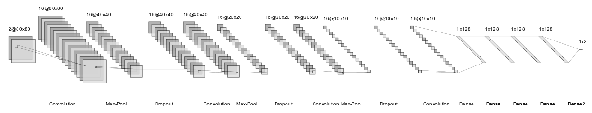
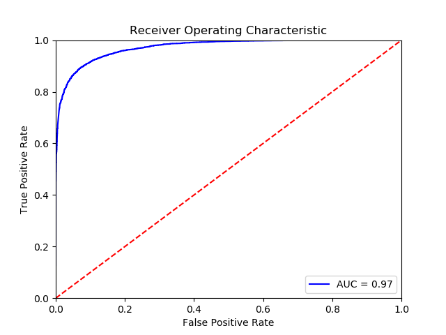

# Face2Face
Deep convolutional network for face matching. This can be extensively used for authentication purposes. See [demo script](NeuralNetwork/Demo.py) for usage example.

## Network Architecture

## Approach
The main idea of Face2Face is use convolutional layers directly to extract similarity between faces depicted in two images.

Two gray scale images are stacked one on top of the other and used as input for the CNN.

The output of the CNN is the probability that the two images contain the face of the same person.

See [presentation](presentation/DLIC.pptx) for more details.

## Results
On our private test training set, we reached an accuracy of: **0.915**.
On LFW (Labelled Faces in the Wild) dataset, we reached **0.745**, but most of the photos contains faces with inappropriate poses.
However, **Precision** should be used as main figure of metric.

### ROC and AUC

### Private dataset
| Threshold  | Accuracy   | Precision |
| ---------- | ---------- | --------- |
| 0.5        | 0.915      | 0.9278    |
| 0.975      | 0.845      | 0.9985    |

### LFW dataset
| Threshold  | Accuracy   | Precision |
| ---------- | ---------- | --------- |
| 0.5        | 0.775      | 0.7474    |
| 0.975      | 0.745      | 0.9824    |